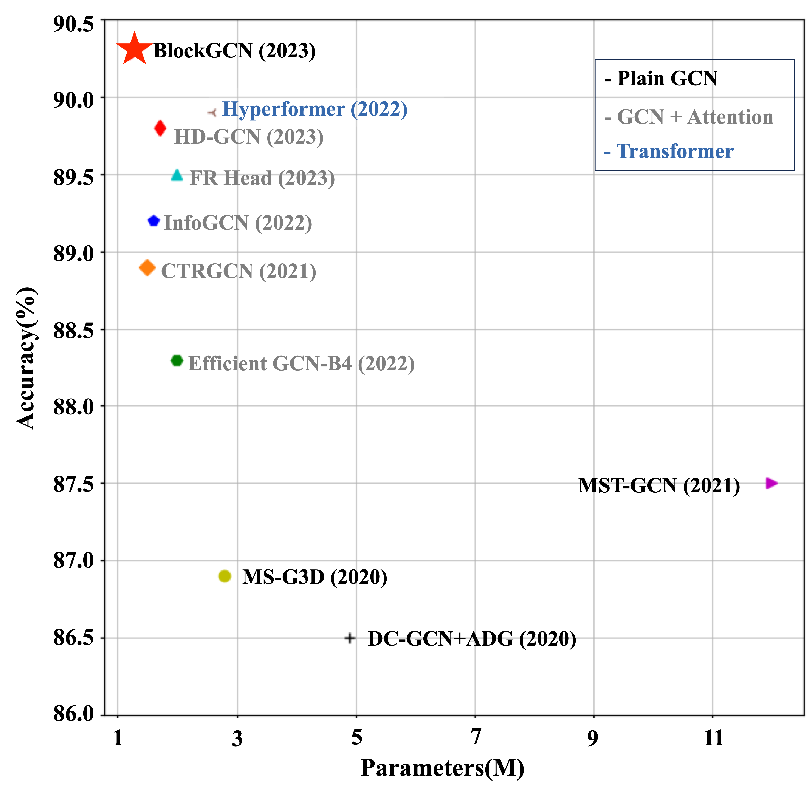
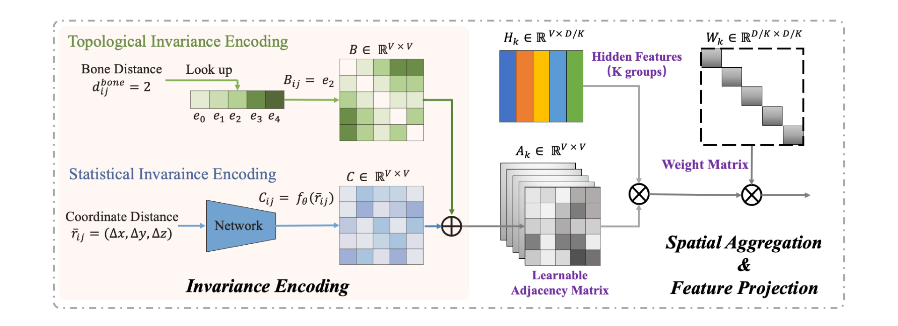

# BlockGCN: Redefining Topology Awareness for Skeleton-Based Action Recognition 

[](https://www.youtube.com/watch?v=-SPN-HxDsJk&t=85s)
[](https://openaccess.thecvf.com/content/CVPR2024/papers/Zhou_BlockGCN_Redefine_Topology_Awareness_for_Skeleton-Based_Action_Recognition_CVPR_2024_paper.pdf)

## Performance vs. Model Size on NTU RGB+D 120 Cross-Subject Benchmark
<p align="center">
   
</p>
<p align="center">
   <b>Figure 1:</b> This graph demonstrates the superior performance of BlockGCN compared to existing methods on the NTU RGB+D 120 Cross-Subject Benchmark. BlockGCN achieves higher accuracy with fewer parameters, indicating its efficiency and effectiveness.
</p>

## Illustration of BlockGC 
<p align="center">
   
</p>
<p align="center">
   <b>Figure 2:</b> An illustration of the BlockGC structure within BlockGCN. BlockGC divides the feature dimension into multiple groups, applying spatial aggregation and feature projection in parallel to efficiently model high-level semantics.
</p>

# Preparation
### Install torchlight
Run `pip install -e torchlight`

### Download datasets.

#### There are 3 datasets to download:

- NTU RGB+D 60 Skeleton
- NTU RGB+D 120 Skeleton
- NW-UCLA

#### NTU RGB+D 60 and 120

1. Request dataset here: https://rose1.ntu.edu.sg/dataset/actionRecognition
2. Download the skeleton-only datasets:
   1. `nturgbd_skeletons_s001_to_s017.zip` (NTU RGB+D 60)
   2. `nturgbd_skeletons_s018_to_s032.zip` (NTU RGB+D 120)
   3. Extract above files to `./data/nturgbd_raw`

#### NW-UCLA

1. Download dataset from [CTR-GCN](https://github.com/Uason-Chen/CTR-GCN)
2. Move `all_sqe` to `./data/NW-UCLA`

### Data Processing

#### Directory Structure

Put downloaded data into the following directory structure:

```
- data/
  - NW-UCLA/
    - all_sqe
      ... # raw data of NW-UCLA
  - ntu/
  - ntu120/
  - nturgbd_raw/
    - nturgb+d_skeletons/     # from `nturgbd_skeletons_s001_to_s017.zip`
      ...
    - nturgb+d_skeletons120/  # from `nturgbd_skeletons_s018_to_s032.zip`
      ...
```

#### Generating Data

- Generate NTU RGB+D 60 or NTU RGB+D 120 dataset:

```
 cd ./data/ntu # or cd ./data/ntu120
 # Get skeleton of each performer
 python get_raw_skes_data.py
 # Remove the bad skeleton 
 python get_raw_denoised_data.py
 # Transform the skeleton to the center of the first frame
 python seq_transformation.py
```

# Training & Testing

### Training

```
bash train.sh
```

Please check the configuration in the config directory.

### Testing

```
bash evaluate.sh
```

To ensemble the results of different modalities, run the following command:

```
bash ensemble.sh
```

## Acknowledgements

This repo is based on [2s-AGCN](https://github.com/lshiwjx/2s-AGCN) and [CTR-GCN](https://github.com/Uason-Chen/CTR-GCN). The data processing is borrowed from [SGN](https://github.com/microsoft/SGN) and [HCN](https://github.com/huguyuehuhu/HCN-pytorch), and the training strategy is based on [Hyperformer](https://github.com/ZhouYuxuanYX/Hyperformer).

Thanks to the original authors for their work!

## References

```bibtex
@inproceedings{zhou2024blockgcn,
  title={BlockGCN: Redefining Topology Awareness for Skeleton-Based Action Recognition},
  author={Zhou, Yuxuan and Yan, Xudong and Cheng, Zhi-Qi and Yan, Yan and Dai, Qi and Hua, Xian-Sheng},
  booktitle={Proceedings of the IEEE/CVF Conference on Computer Vision and Pattern Recognition},
  year={2024}
}

@article{zhou2023overcoming,
  title={Overcoming topology agnosticism: Enhancing skeleton-based action recognition through redefined skeletal topology awareness},
  author={Zhou, Yuxuan and Cheng, Zhi-Qi and He, Jun-Yan and Luo, Bin and Geng, Yifeng and Xie, Xuansong},
  journal={arXiv preprint arXiv:2305.11468},
  year={2023}
}
